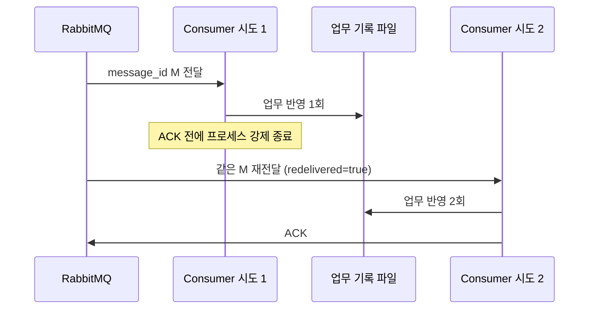

# Phase 2 · 전달과 ACK

## 학습 질문

처리는 끝났는데 ACK 전에 Consumer가 죽으면 업무가 다시 실행될까?

## 예상과 관찰

| 항목 | ACK 전 종료 | Broker가 ACK를 반영한 뒤 종료 |
|---|---|---|
| 종료 전 업무 반영 | 1회 | 1회 |
| 종료 후 Ready | 재전달 대기 메시지 존재 | 해당 메시지 없음 |
| Consumer 재시작 | 같은 Message ID, 새로운 Attempt ID | 해당 메시지 재전달 없음 |
| 재전달 후 업무를 다시 반영 | 총 2회 | 총 1회 유지 |

위 표는 독립된 Queue와 메시지 1개를 사용하는 실험의 예상입니다. 실제 결과는 Broker 지표, 이벤트, `data/phase2-effects.jsonl`을 확인합니다.

## 흐름

## 안전한 실험 범위

Phase 2 제어기는 자신이 생성한 한 자식 프로세스만 제어합니다. 실행 명령은 고정되어 있고, `shell=False`이며 사용자에게 실행 파일·PID를 받지 않습니다. 종료는 일반 Worker 관리 기능이 아니라 이 학습 실험의 고정 동작입니다.

## 기록의 의미

- DELIVERED: Worker callback이 실제 전달을 관측했다.
- PROCESSED: 학습용 업무 효과를 파일에 저장하고 fsync한 뒤 기록했다.
- ACK_SENT: Worker가 ACK를 전송했다. Broker가 처리한 정확한 시각은 아니다.
- WORKER_EXITED: 관리자가 생성한 자식 프로세스가 종료됐음을 관측했다.
- WORKER_KILLED: 실험 제어기가 자신이 만든 프로세스를 강제 종료하고 종료를 확인했다.

관측 기록 자체도 Broker의 업무 트랜잭션과 원자적이지 않습니다. 기록 누락이 업무 미실행을 뜻한다고 단정하지 않습니다. 업무 효과와 메시지 삭제 사이의 간격이 중복 문제의 출발점입니다.

## 완료 기준

- ACK 전 종료 후 같은 메시지가 재전달됨을 확인한다.
- 업무 반영과 ACK가 별개이며 중복 업무가 생길 수 있음을 설명한다.
- Broker가 ACK를 반영한 뒤 종료하는 경우와 결과를 비교한다.

[RabbitMQ ACK 공식 문서](https://www.rabbitmq.com/docs/confirms)
